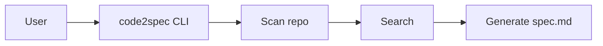

# 仕様書（自動生成）

- 対象リポジトリ: `/Users/s-kusaba/projects/code2spec-agent`
- 生成日時: 2025-12-18T23:58:15

## 1. 目的
このドキュメントは、コードベースをスキャンして推定した仕様のたたき台です。

## 2. 主要ファイル（候補）
- `app/__init__.py`
- `app/ingest.py`
- `app/main.py`
- `app/render.py`
- `app/retrieve.py`

## 3. 検索結果（Evidence）
- `/Users/s-kusaba/projects/code2spec-agent/app/ingest.py`: from __future__ import annotations from pathlib import Path  DEFAULT_EXCLUDE_DIRS = {     ".git", ".venv", "node_modules", "__pycache__", ".pytest_cache", ".mypy_cache",     "dist", "build", ".next", ".cache" } DEFAU
- `/Users/s-kusaba/projects/code2spec-agent/app/main.py`: from __future__ import annotations import argparse from pathlib import Path  from app.ingest import iter_text_files from app.retrieve import search_files from app.render import render_spec  def main():     ap = argpa
- `/Users/s-kusaba/projects/code2spec-agent/app/render.py`: from __future__ import annotations from datetime import datetime from pathlib import Path  def render_spec(out_path: Path, repo_path: Path, top_files: list[str], hits: list[dict]) -> None:     out_path.parent.mkdir(p
- `/Users/s-kusaba/projects/code2spec-agent/app/retrieve.py`: from __future__ import annotations from pathlib import Path import re  def search_files(files: list[Path], query: str, max_hits: int = 20) -> list[dict]:     pattern = re.compile(re.escape(query), re.IGNORECASE)     

## 4. Mermaid（仮）

